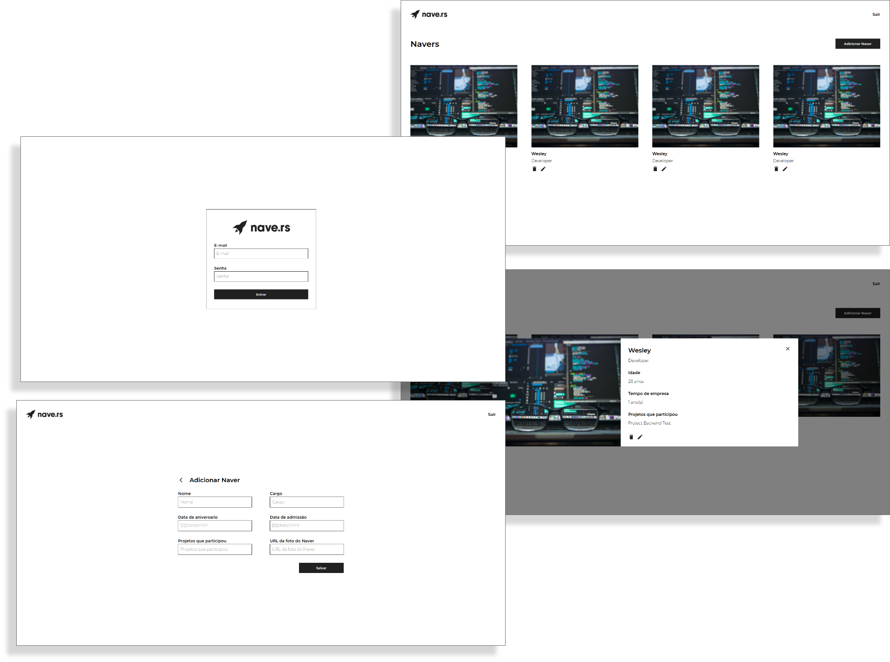

<h1 align="center">
    
</h1>

<p align="center">
  

  
  
  <a href="https://github.com/WesleyMarquesGit/TesteNave/commits/master">
    
  </a>

  
   <a href="https://github.com/WesleyMarquesGit/TesteNave/stargazers">
    
  </a>
</p>

---

### :rocket: Sobre o projeto

Navedex - O projeto que desenvolvido como teste para vaga de frontend na empresa Nave.rs, consiste em uma web app para visualização e criação de navers (membros da empresa), possuindo informações como: nomes, idades, cargos, tempo de empresa e projetos que participou.

---

### 🎨 Interface

<h1 align="center">
  
</h1>

#### UI do projeto: [Figma](https://www.figma.com/file/II8UDFm2uJFZaD0FOPcinP/Teste-Fornt-End?node-id=0%3A1)

---

### :space_invader: Tecnologias

As seguintes ferramentas foram usadas na construção do projeto:

- [React][reactjs]
- [Styled-components][styledcomponents]

---

### :computer: Manual

#### Pré-requisitos

- É **necessário** possuir o **[Git][git]** instalado e configurado no computador
- Também, é **preciso** ter um gerenciador de pacotes seja o **[NPM][npm]** ou **[Yarn][yarn]**.

#### Como executar

```bash
# Clone este repositório
$ git clone https://github.com/WesleyMarquesGit/TesteNave.git

# Acesse a pasta do projeto no seu terminal/cmd
$ cd TesteNave/frontend

# Instale as dependências
$ yarn

# Execute a aplicação
$ yarn start

# A aplicação será aberta na porta:3000 - acesse http://localhost:3000

├── /src
|   ├── /components
|   ├── /pages

```

#### Como logar

```bash

# Utilize o login:
$ testing-user@nave.rs

# e a senha:
$ nave1234

```

---

### :recycle: Como contribuir para o projeto

1. Faça um **fork** do projeto.
2. Crie uma nova branch com as suas alterações: `git checkout -b my-feature`
3. Salve as alterações e crie uma mensagem de commit contando o que você fez: `git commit -m "feature: My new feature"`
4. Envie as suas alterações: `git push origin my-feature`

---

### :page_with_curl: Licença

Este projeto esta sobe a licença MIT.

---

[yarn]: https://yarnpkg.com/
[npm]: https://www.npmjs.com/
[reactjs]: https://reactjs.org
[styledcomponents]: https://styled-components.com/docs/basics
[git]: https://git-scm.com/
[license]: https://opensource.org/licenses/MIT
